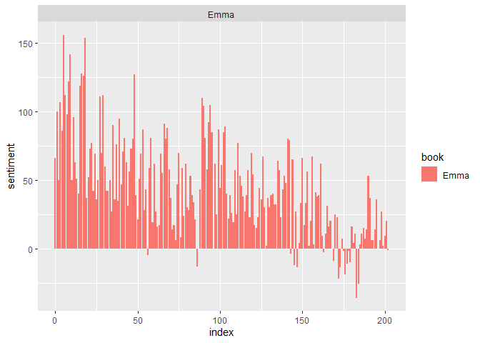
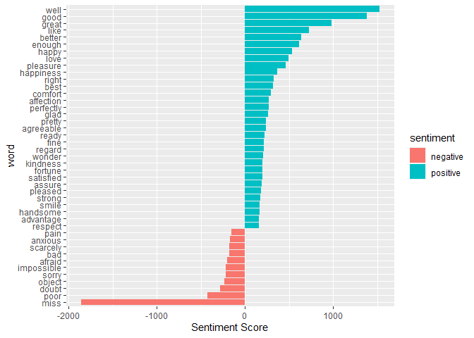
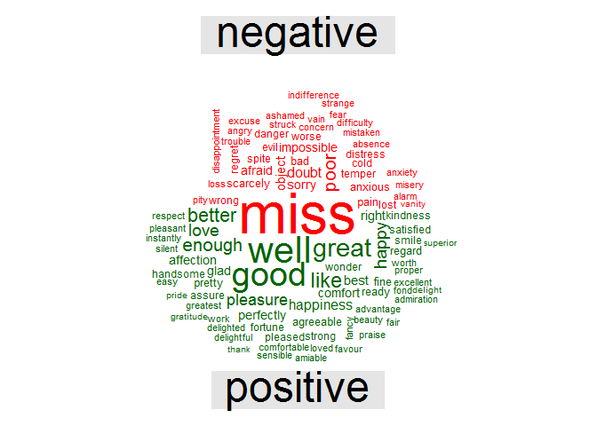

Sentiment Analysis
================
Ekaterina P
08 02 2021

## About

The aim of this project is to build a sentiment analysis model which
will allow us to categorize words based on their sentiments, that is
whether they are positive, negative and also the magnitude of it.

## Before we start

We will use the dataset of ‘sentiments’ from the tidytext package that
comprises of sentiment lexicons. We will make use of the bing lexicons
(classifies the sentiment into a binary category of negative or
positive) to extract the sentiments out of our data.

``` r
library(tidytext)
get_sentiments("bing")
```

    ## # A tibble: 6,786 x 2
    ##    word        sentiment
    ##    <chr>       <chr>    
    ##  1 2-faces     negative 
    ##  2 abnormal    negative 
    ##  3 abolish     negative 
    ##  4 abominable  negative 
    ##  5 abominably  negative 
    ##  6 abominate   negative 
    ##  7 abomination negative 
    ##  8 abort       negative 
    ##  9 aborted     negative 
    ## 10 aborts      negative 
    ## # ... with 6,776 more rows

## Sentiment Analysis

Let’s import our libraries ‘janeaustenr’, ‘stringr’. The janeaustenr
package will provide us with the textual data in the form of books
authored by the novelist Jane Austen.

    ## 
    ## Attaching package: 'dplyr'

    ## The following objects are masked from 'package:stats':
    ## 
    ##     filter, lag

    ## The following objects are masked from 'package:base':
    ## 
    ##     intersect, setdiff, setequal, union

Now each row contains a single word. We will now make use of the “bing”
lexicon to and implement filter() over the words that correspond to joy.
We will use the book Sense and Sensibility and derive its words to
implement out sentiment analysis model.

``` r
positive_senti <- get_sentiments("bing") %>%
 filter(sentiment == "positive")

tidy_data %>%
 filter(book == "Emma") %>%
 semi_join(positive_senti) %>%
 count(word, sort = TRUE)
```

    ## Joining, by = "word"

    ## # A tibble: 668 x 2
    ##    word         n
    ##    <chr>    <int>
    ##  1 well       401
    ##  2 good       359
    ##  3 great      264
    ##  4 like       200
    ##  5 better     173
    ##  6 enough     129
    ##  7 happy      125
    ##  8 love       117
    ##  9 pleasure   115
    ## 10 right       92
    ## # ... with 658 more rows

From our above result we observe many positive words like “good”,
“amuse”, “outstanding” etc. In the next step we will use spread()
function to segregate our data into separate columns of positive and
negative sentiments.

``` r
library(tidyr)
bing <- get_sentiments("bing")
Emma_sentiment <- tidy_data %>%
 inner_join(bing) %>%
 count(book = "Emma" , index = linenumber %/% 80, sentiment) %>%
 spread(sentiment, n, fill = 0) %>%
 mutate(sentiment = positive - negative)
```

    ## Joining, by = "word"

Let’s visualize the words present in the book “Emma” based on their
corresponding positive and negative scores.

``` r
library(ggplot2)

ggplot(Emma_sentiment, aes(index, sentiment, fill = book)) +
 geom_bar(stat = "identity", show.legend = TRUE) +
 facet_wrap(~book, ncol = 2, scales = "free_x")
```

<!-- -->

Count the most common positive and negative words that are present in
the novel.

``` r
counting_words <- tidy_data %>%
 inner_join(bing) %>%
 count(word, sentiment, sort = TRUE)
```

    ## Joining, by = "word"

``` r
head(counting_words)
```

    ## # A tibble: 6 x 3
    ##   word   sentiment     n
    ##   <chr>  <chr>     <int>
    ## 1 miss   negative   1855
    ## 2 well   positive   1523
    ## 3 good   positive   1380
    ## 4 great  positive    981
    ## 5 like   positive    725
    ## 6 better positive    639

Now we will plot the scores along the axis that is labeled with both
positive as well as negative words.

``` r
counting_words %>%
 filter(n > 150) %>%
 mutate(n = ifelse(sentiment == "negative", -n, n)) %>%
 mutate(word = reorder(word, n)) %>%
 ggplot(aes(word, n, fill = sentiment))+
 geom_col() +
 coord_flip() +
 labs(y = "Sentiment Score")
```

<!-- -->

And finally we create a wordcloud that delineates the most recurring
positive and negative words.

``` r
library(reshape2)
```

    ## 
    ## Attaching package: 'reshape2'

    ## The following object is masked from 'package:tidyr':
    ## 
    ##     smiths

``` r
library(wordcloud)
```

    ## Loading required package: RColorBrewer

``` r
tidy_data %>%
 inner_join(bing) %>%
 count(word, sentiment, sort = TRUE) %>%
 acast(word ~ sentiment, value.var = "n", fill = 0) %>%
 comparison.cloud(colors = c("red", "dark green"),
          max.words = 100)
```

    ## Joining, by = "word"

<!-- -->

This word cloud will enable us to efficiently visualize the negative as
well as positive groups of data. Therefore, we are now able to see the
different groups of data based on their corresponding sentiments.
